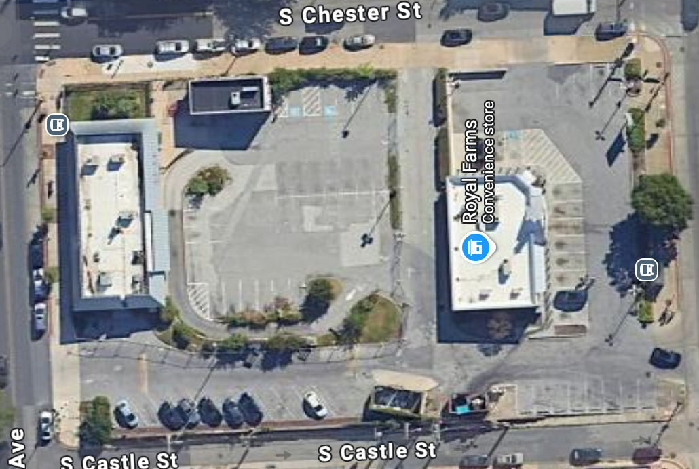
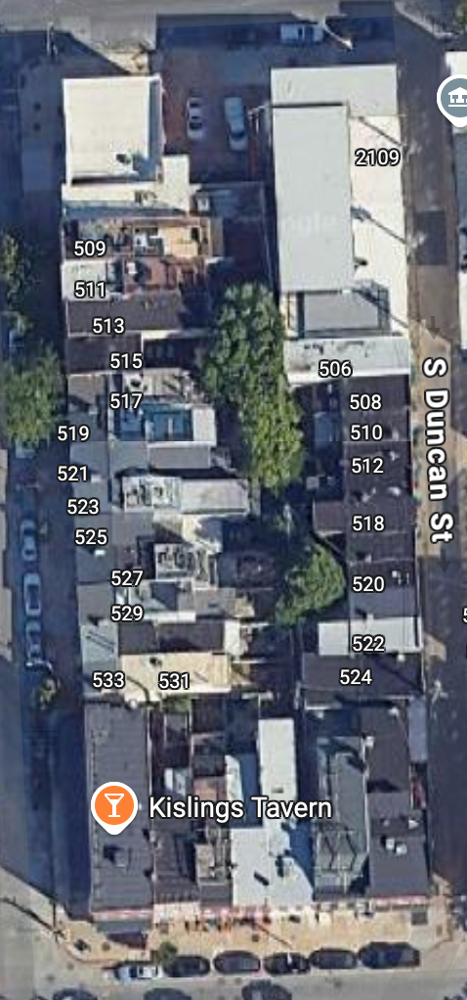
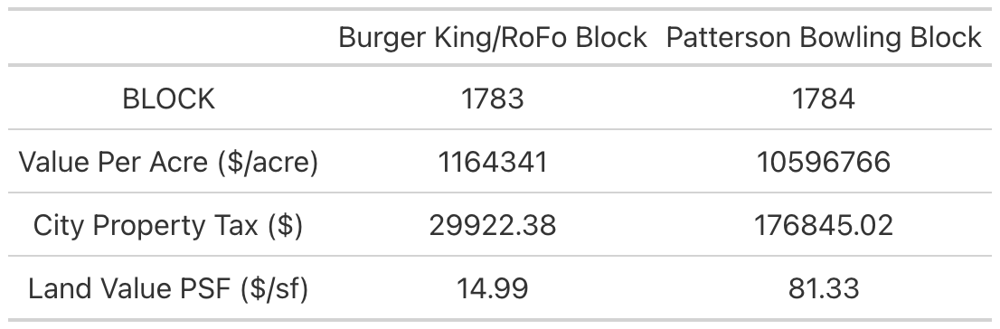
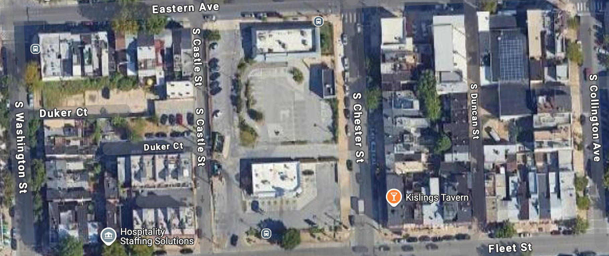

## Initial Patterson Bowling Analysis {.text-center}

:::: {.columns}

::: {.column style="text-align:center;" width="50%"}
Burger King/Rofo Block

:::

::: {.column width="50%" style="text-align:center;"}
Patterson Bowling Block

:::

::::

Two adjacent blocks, two very different uses of land

## Comparing financial productivity

## The 2-Block City

## Visualizing disparities in assessment value

<iframe src="Images/two_block_city.html" width="100%" height="500px"></iframe>

